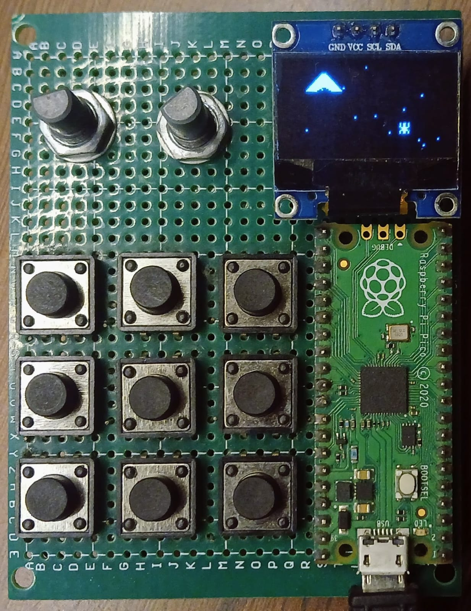
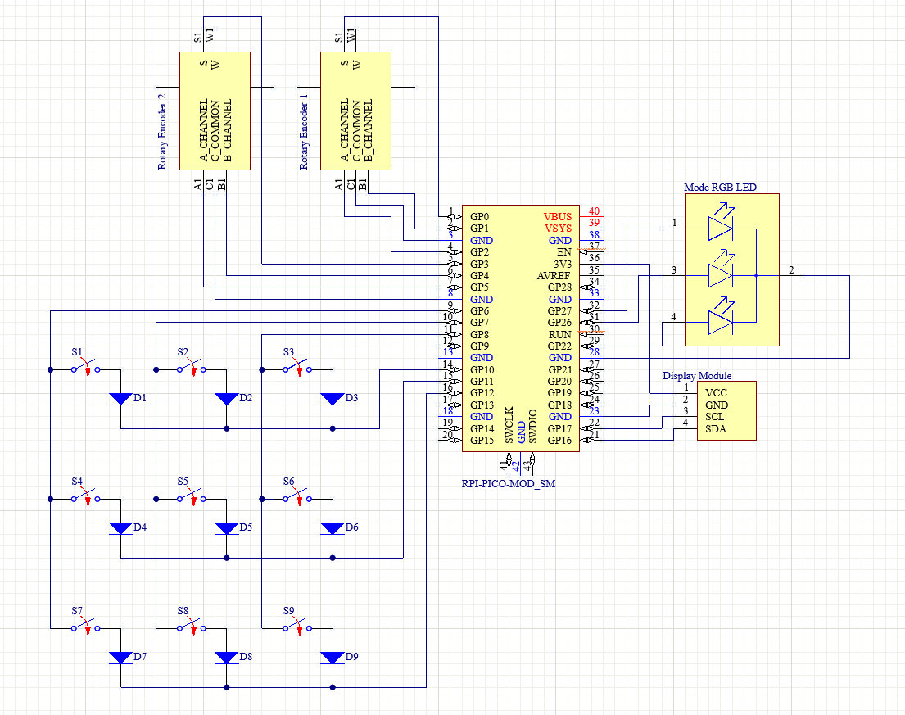

# Customizable and Configurable Macropad

A custom programmable macropad featuring a 3x3 key matrix, 2 rotary encoders, and an OLED display. Powered by a Raspberry Pi Pico running CircuitPython and KMK Keyboard Firmware, this project includes a local web interface to reconfigure keys, macros, and settings.

<p align="center">

</p>

---

## Overview

This repository contains all hardware schematics, firmware files, and web interface code required to build and customize your macropad.

- **Hardware Base:** Raspberry Pi Pico (RP2040)
- **Inputs & Display:** 3x3 Key Matrix, 2 Rotary Encoders, 0.96" OLED Display
- **Firmware:** CircuitPython + KMK Firmware
- **Configurator:** Flask-based Web Application (`Desktop-app.py`) hosted locally at `http://127.0.0.1:5000`

---

## Features

- **Dynamic Keymapping:** Real-time keymap and macro updates without manual code editing.
- **Hardware Integration:** 3x3 switch matrix, dual rotary encoders, and OLED status display.
- **Hardware Design Included:** Full schematics for easy assembly and wiring.
- **Lightweight Web App:** Local desktop interface with minimal dependencies.

---

## Hardware Setup

Assemble the physical macropad according to the schematic in the repository before flashing software.

<p align="center">

</p>

1. Wire the switch matrix, rotary encoders, OLED display, and diodes to the Raspberry Pi Pico as specified in the schematic.
2. Inspect all solder points to verify connectivity and prevent short circuits before plugging in the device.

---

## Software & Firmware Installation

Follow these steps sequentially to configure the Raspberry Pi Pico.

### 1. Flash CircuitPython (UF2 File)
1. Press and hold the **BOOTSEL** button on your Raspberry Pi Pico, then plug it into your computer via USB.
2. Open the mounted mass storage device named `RPI-RP2`.
3. Drag and drop the CircuitPython `.uf2` file onto the drive.
4. The board will reboot and remount as `CIRCUITPY`.

### 2. Install KMK Firmware
1. Locate the `kmk` directory inside the `firmware/` folder (or download the latest release from the [KMK Firmware Repository](https://github.com/KMKfw/kmk_firmware)).
2. Copy the `kmk` directory directly into the root folder of the `CIRCUITPY` drive.

### 3. Install Libraries
1. Copy all contents from the provided `lib/` folder in this repository into the `lib/` directory on your `CIRCUITPY` drive.

### 4. Deploy `boot.py`
1. Copy `boot.py` from this repository to the root directory of your `CIRCUITPY` drive.
2. This configures USB CDC/HID permissions and hardware initialization.

### 5. Deploy `code.py`
1. Copy `On-board-code.py` from this repository to the root directory of your `CIRCUITPY` drive and rename it to `code.py`.
2. This serves as the main KMK runtime file, managing the key matrix pins, rotary encoder handlers, OLED driver, and default layouts.

---

## Web Application Setup

The configuration web app allows you to modify key assignments and macros directly through a browser interface.

### Prerequisites
- Python 3.8 or higher installed on your system.

### Running the Configurator
1. Connect the macropad to your computer via USB.
2. Launch the backend configuration server:
   ```bash
   python Desktop-app.py
   ```
   
(Alternatively, double-click Desktop-app.py to run it directly).

3. Keep Desktop-app.py running in the background.
4. Open your browser and navigate to:
```
http://127.0.0.1:5000
```
5. Use the control panel to reassign keys, assign macros, and save changes directly to the macropad.

<p align="center">

</p>

### Contributing

Pull requests, feature requests, and bug reports are welcome. Feel free to open an issue or submit a PR to help improve the project.
